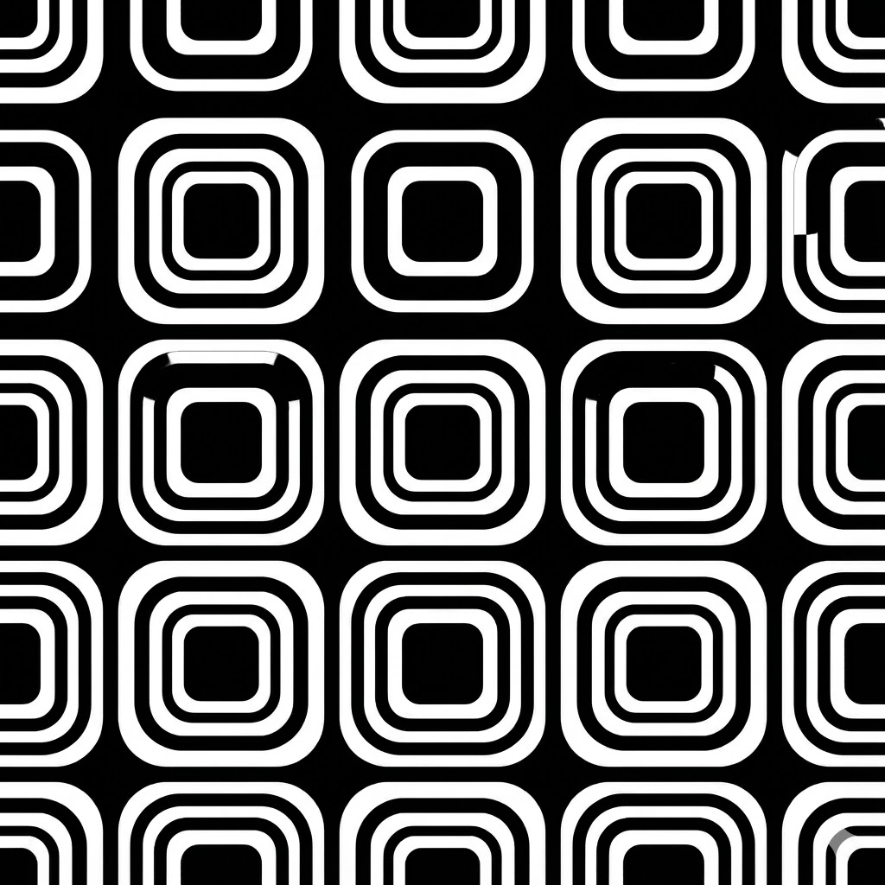

<!-- _class: title -->
<!-- _backgroundImage: url('images/placeholder-landscape-dark.png') -->

# Midnight Grid

## Modern dark theme for technical presentations

---

## Refined Typography

- **Work Sans** for clear headings
- *Inter* for excellent readability
- Perfect for low-light environments

---

## Balanced Colors

**Sky Blue** (#64B5F6) for primary elements
**Rose** (#E57373) for emphasis

> Modern, technical, and easy on the eyes

---

# Present in the Dark

A sleek foundation for technical content.

---

<!-- _class: image-left -->

# Image Left Layout

## Portrait images (9:16)

Perfect for vertical content

---

<!-- _class: two-column -->

# Two-Column Layout

## Left

## Right

---

<!-- _class: full-image -->

