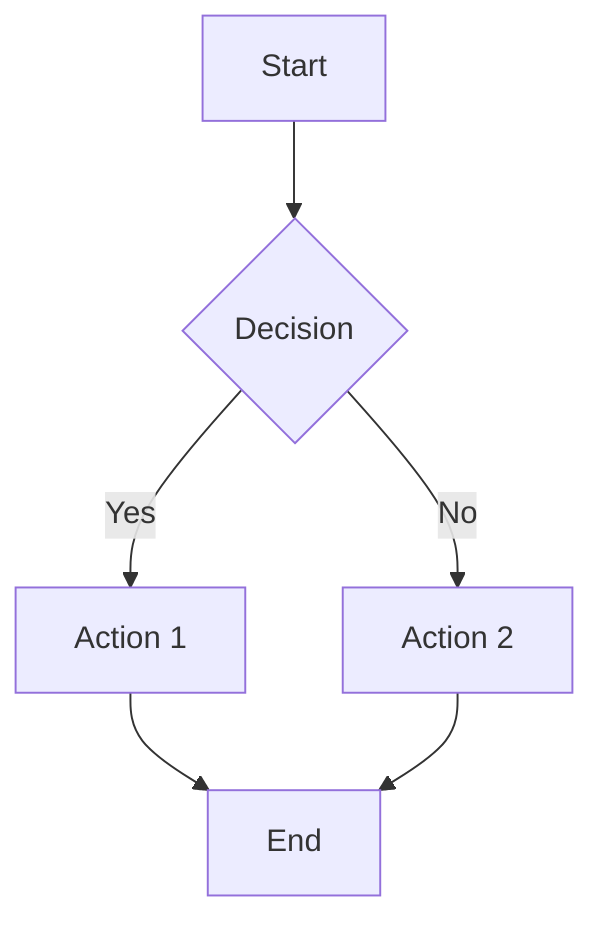
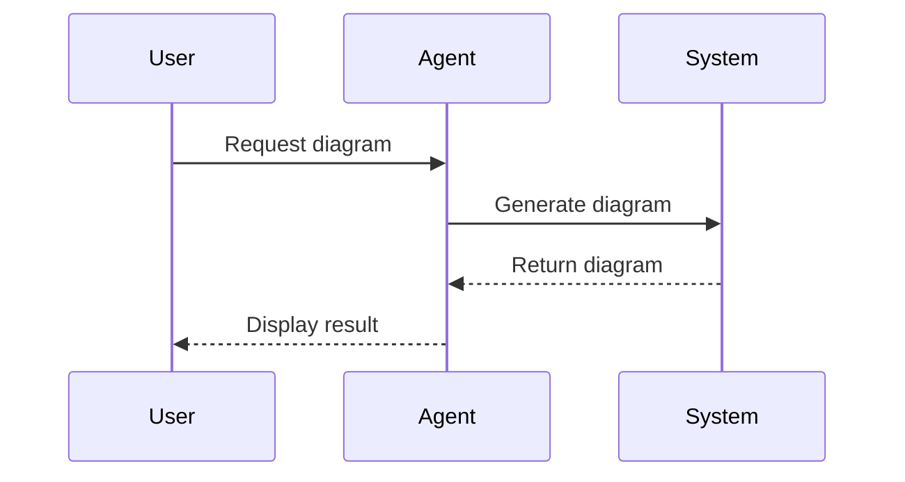
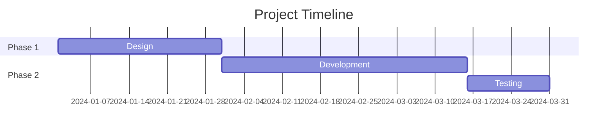

# Diagram Support Demo

## Mermaid and Excalidraw Examples

This presentation demonstrates native diagram support in DeckBot.

---

# Mermaid Flowchart Example



---

# Mermaid Sequence Diagram Example



---

# Mermaid Gantt Chart Example



---

# Excalidraw Diagram Example

```excalidraw
{
  "type": "excalidraw",
  "version": 2,
  "source": "https://excalidraw.com",
  "elements": [
    {
      "type": "rectangle",
      "version": 1,
      "versionNonce": 1,
      "isDeleted": false,
      "id": "rect1",
      "fillStyle": "solid",
      "strokeWidth": 2,
      "strokeStyle": "solid",
      "roughness": 1,
      "opacity": 100,
      "angle": 0,
      "x": 100,
      "y": 100,
      "strokeColor": "#000000",
      "backgroundColor": "#15aabf",
      "width": 200,
      "height": 100,
      "seed": 1,
      "groupIds": [],
      "frameId": null,
      "roundness": null,
      "boundElements": [],
      "updated": 1,
      "link": null,
      "locked": false
    },
    {
      "type": "text",
      "version": 1,
      "versionNonce": 2,
      "isDeleted": false,
      "id": "text1",
      "fillStyle": "solid",
      "strokeWidth": 2,
      "strokeStyle": "solid",
      "roughness": 1,
      "opacity": 100,
      "angle": 0,
      "x": 150,
      "y": 130,
      "strokeColor": "#000000",
      "backgroundColor": "transparent",
      "width": 100,
      "height": 25,
      "seed": 2,
      "groupIds": [],
      "frameId": null,
      "roundness": null,
      "boundElements": [],
      "updated": 1,
      "link": null,
      "locked": false,
      "fontSize": 20,
      "fontFamily": 1,
      "text": "Hello!",
      "textAlign": "center",
      "verticalAlign": "middle",
      "baseline": 18,
      "containerId": null,
      "originalText": "Hello!",
      "lineHeight": 1.25
    }
  ],
  "appState": {
    "gridSize": null,
    "viewBackgroundColor": "#ffffff"
  }
}
```

---

# Additional Diagram Types

DeckBot supports many diagram types via Kroki:

- **Mermaid**: Flowcharts, sequence diagrams, Gantt charts, class diagrams
- **Excalidraw**: Hand-drawn style diagrams
- **PlantUML**: UML diagrams
- **GraphViz**: Graph layouts
- **D2**: Declarative diagramming
- **And many more!**

---

# Usage

Simply use code blocks with the diagram type:

\`\`\`mermaid
graph TD
    A --> B
\`\`\`

The diagrams are rendered as first-class components in your slides!


